# 911 Calls Data Exploration

In this project we will be analyzing some 911 call data from [Kaggle](https://www.kaggle.com/mchirico/montcoalert). The data contains the following fields:

* lat : String variable, Latitude
* lng: String variable, Longitude
* desc: String variable, Description of the Emergency Call
* zip: String variable, Zipcode
* title: String variable, Title
* timeStamp: String variable, YYYY-MM-DD HH:MM:SS
* twp: String variable, Township
* addr: String variable, Address
* e: String variable, Dummy variable (always 1)

## Data and Setup


```python
#Required Imports
import numpy as np
import pandas as pd

import seaborn as sns
sns.set(style='whitegrid')
import matplotlib.pyplot as plt
%matplotlib inline
```


```python
#Importing The Data Into Dataframe
call_data = pd.read_csv('911.csv')
call_data.info()
```

    <class 'pandas.core.frame.DataFrame'>
    RangeIndex: 99492 entries, 0 to 99491
    Data columns (total 9 columns):
    lat          99492 non-null float64
    lng          99492 non-null float64
    desc         99492 non-null object
    zip          86637 non-null float64
    title        99492 non-null object
    timeStamp    99492 non-null object
    twp          99449 non-null object
    addr         98973 non-null object
    e            99492 non-null int64
    dtypes: float64(3), int64(1), object(5)
    memory usage: 6.8+ MB
    


```python
call_data.head(3)
```


<div>
<style scoped>
    .dataframe tbody tr th:only-of-type {
        vertical-align: middle;
    }

    .dataframe tbody tr th {
        vertical-align: top;
    }

    .dataframe thead th {
        text-align: right;
    }
</style>
<table border="1" class="dataframe">
  <thead>
    <tr style="text-align: right;">
      <th></th>
      <th>lat</th>
      <th>lng</th>
      <th>desc</th>
      <th>zip</th>
      <th>title</th>
      <th>timeStamp</th>
      <th>twp</th>
      <th>addr</th>
      <th>e</th>
    </tr>
  </thead>
  <tbody>
    <tr>
      <th>0</th>
      <td>40.297876</td>
      <td>-75.581294</td>
      <td>REINDEER CT &amp; DEAD END;  NEW HANOVER; Station ...</td>
      <td>19525.0</td>
      <td>EMS: BACK PAINS/INJURY</td>
      <td>2015-12-10 17:40:00</td>
      <td>NEW HANOVER</td>
      <td>REINDEER CT &amp; DEAD END</td>
      <td>1</td>
    </tr>
    <tr>
      <th>1</th>
      <td>40.258061</td>
      <td>-75.264680</td>
      <td>BRIAR PATH &amp; WHITEMARSH LN;  HATFIELD TOWNSHIP...</td>
      <td>19446.0</td>
      <td>EMS: DIABETIC EMERGENCY</td>
      <td>2015-12-10 17:40:00</td>
      <td>HATFIELD TOWNSHIP</td>
      <td>BRIAR PATH &amp; WHITEMARSH LN</td>
      <td>1</td>
    </tr>
    <tr>
      <th>2</th>
      <td>40.121182</td>
      <td>-75.351975</td>
      <td>HAWS AVE; NORRISTOWN; 2015-12-10 @ 14:39:21-St...</td>
      <td>19401.0</td>
      <td>Fire: GAS-ODOR/LEAK</td>
      <td>2015-12-10 17:40:00</td>
      <td>NORRISTOWN</td>
      <td>HAWS AVE</td>
      <td>1</td>
    </tr>
  </tbody>
</table>
</div>


## Basic Exploration

** What are the top 5 zipcodes for 911 calls? **


```python
call_data['zip'].value_counts().head(5)
```


    19401.0    6979
    19464.0    6643
    19403.0    4854
    19446.0    4748
    19406.0    3174
    Name: zip, dtype: int64


** What are the top 5 townships (twp) for 911 calls? **


```python
call_data['twp'].value_counts()[:5]
```


    LOWER MERION    8443
    ABINGTON        5977
    NORRISTOWN      5890
    UPPER MERION    5227
    CHELTENHAM      4575
    Name: twp, dtype: int64


** How many unique title codes are there? **


```python
call_data['title'].nunique()
```


    110


## Creating new features

** In the titles column there are "Reasons/Departments" specified before the title code. These are EMS, Fire, and Traffic.Let's use .apply() with a custom lambda expression to create a new column called "Reason" that contains this string value.** 

**For example, if the title column value is EMS: BACK PAINS/INJURY , the Reason column value would be EMS. **


```python
call_data['reason'] = call_data['title'].apply(lambda title:title.split(':')[0])
```

** What is the most common Reason for a 911 call based off of this new column? **


```python
call_data['reason'].value_counts()
```


    EMS        48877
    Traffic    35695
    Fire       14920
    Name: reason, dtype: int64


** Now use seaborn to create a countplot of 911 calls by Reason. **


```python
sns.countplot(call_data['reason'], palette='viridis')
```


    <matplotlib.axes._subplots.AxesSubplot at 0xed80c72ac8>


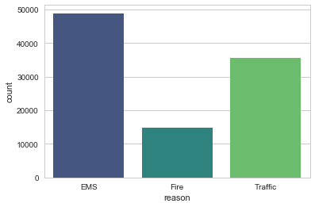


___
** Now let us begin to focus on time information. What is the data type of the objects in the timeStamp column? **


```python
type(call_data['timeStamp'][0])
```


    str


** Lets use [pd.to_datetime](http://pandas.pydata.org/pandas-docs/stable/generated/pandas.to_datetime.html) to convert the column from strings to DateTime objects. **


```python
call_data['timeStamp'] = pd.to_datetime(call_data['timeStamp'])
```

** Now that the timestamp column are actually DateTime objects, we can use .apply() to create 3 new columns called Hour, Month, and Day of Week.**


```python
call_data['hour'] = call_data['timeStamp'].apply(lambda data : data.hour) 
call_data['month'] =  call_data['timeStamp'].apply(lambda data : data.month) 
call_data['day of week'] = call_data['timeStamp'].apply(lambda data : data.dayofweek)
```

** Now that the Day of Week is an integer 0-6. we can use the .map() with this dictionary to map the actual string names to the day of the week: **


```python
dmap = {0:'Mon',1:'Tue',2:'Wed',3:'Thu',4:'Fri',5:'Sat',6:'Sun'}
call_data['day of week'] = call_data['day of week'].map(dmap)
```

** Now let's use seaborn to create a countplot of the Day of Week column with the hue based off of the Reason column. **


```python
sns.countplot(data=call_data, x='day of week', hue='reason', palette='viridis')
plt.legend(loc=0, bbox_to_anchor=(1.3, 1))
```


    <matplotlib.legend.Legend at 0xedfae749e8>


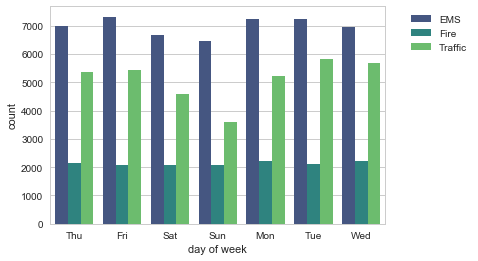


**Now Let's do the same for Month:**


```python
sns.countplot(data=call_data, x='month', hue='reason', palette='viridis')
plt.legend(loc=0, bbox_to_anchor=(1.3, 1))
```


    <matplotlib.legend.Legend at 0xed8155ce10>


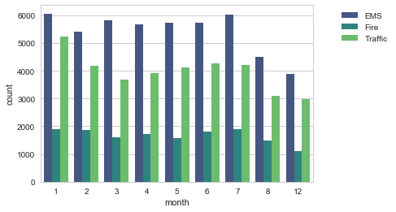


**Did you notice something strange about the Plot?**

_____

** You should have noticed it was missing some Months, let's see if we can maybe fill in this information by plotting the information in another way, possibly a simple line plot that fills in the missing months, in order to do this, we'll need to do some work with pandas... **

** Now create a gropuby object called byMonth, where you group the DataFrame by the month column and use the count() method for aggregation. Use the head() method on this returned DataFrame. **


```python
by_month = call_data.groupby('month').count()
by_month
```


<div>
<style scoped>
    .dataframe tbody tr th:only-of-type {
        vertical-align: middle;
    }

    .dataframe tbody tr th {
        vertical-align: top;
    }

    .dataframe thead th {
        text-align: right;
    }
</style>
<table border="1" class="dataframe">
  <thead>
    <tr style="text-align: right;">
      <th></th>
      <th>lat</th>
      <th>lng</th>
      <th>desc</th>
      <th>zip</th>
      <th>title</th>
      <th>timeStamp</th>
      <th>twp</th>
      <th>addr</th>
      <th>e</th>
      <th>reason</th>
      <th>hour</th>
      <th>day of week</th>
    </tr>
    <tr>
      <th>month</th>
      <th></th>
      <th></th>
      <th></th>
      <th></th>
      <th></th>
      <th></th>
      <th></th>
      <th></th>
      <th></th>
      <th></th>
      <th></th>
      <th></th>
    </tr>
  </thead>
  <tbody>
    <tr>
      <th>1</th>
      <td>13205</td>
      <td>13205</td>
      <td>13205</td>
      <td>11527</td>
      <td>13205</td>
      <td>13205</td>
      <td>13203</td>
      <td>13096</td>
      <td>13205</td>
      <td>13205</td>
      <td>13205</td>
      <td>13205</td>
    </tr>
    <tr>
      <th>2</th>
      <td>11467</td>
      <td>11467</td>
      <td>11467</td>
      <td>9930</td>
      <td>11467</td>
      <td>11467</td>
      <td>11465</td>
      <td>11396</td>
      <td>11467</td>
      <td>11467</td>
      <td>11467</td>
      <td>11467</td>
    </tr>
    <tr>
      <th>3</th>
      <td>11101</td>
      <td>11101</td>
      <td>11101</td>
      <td>9755</td>
      <td>11101</td>
      <td>11101</td>
      <td>11092</td>
      <td>11059</td>
      <td>11101</td>
      <td>11101</td>
      <td>11101</td>
      <td>11101</td>
    </tr>
    <tr>
      <th>4</th>
      <td>11326</td>
      <td>11326</td>
      <td>11326</td>
      <td>9895</td>
      <td>11326</td>
      <td>11326</td>
      <td>11323</td>
      <td>11283</td>
      <td>11326</td>
      <td>11326</td>
      <td>11326</td>
      <td>11326</td>
    </tr>
    <tr>
      <th>5</th>
      <td>11423</td>
      <td>11423</td>
      <td>11423</td>
      <td>9946</td>
      <td>11423</td>
      <td>11423</td>
      <td>11420</td>
      <td>11378</td>
      <td>11423</td>
      <td>11423</td>
      <td>11423</td>
      <td>11423</td>
    </tr>
    <tr>
      <th>6</th>
      <td>11786</td>
      <td>11786</td>
      <td>11786</td>
      <td>10212</td>
      <td>11786</td>
      <td>11786</td>
      <td>11777</td>
      <td>11732</td>
      <td>11786</td>
      <td>11786</td>
      <td>11786</td>
      <td>11786</td>
    </tr>
    <tr>
      <th>7</th>
      <td>12137</td>
      <td>12137</td>
      <td>12137</td>
      <td>10633</td>
      <td>12137</td>
      <td>12137</td>
      <td>12133</td>
      <td>12088</td>
      <td>12137</td>
      <td>12137</td>
      <td>12137</td>
      <td>12137</td>
    </tr>
    <tr>
      <th>8</th>
      <td>9078</td>
      <td>9078</td>
      <td>9078</td>
      <td>7832</td>
      <td>9078</td>
      <td>9078</td>
      <td>9073</td>
      <td>9025</td>
      <td>9078</td>
      <td>9078</td>
      <td>9078</td>
      <td>9078</td>
    </tr>
    <tr>
      <th>12</th>
      <td>7969</td>
      <td>7969</td>
      <td>7969</td>
      <td>6907</td>
      <td>7969</td>
      <td>7969</td>
      <td>7963</td>
      <td>7916</td>
      <td>7969</td>
      <td>7969</td>
      <td>7969</td>
      <td>7969</td>
    </tr>
  </tbody>
</table>
</div>


** Now create a simple plot off of the dataframe indicating the count of calls per month. **


```python
by_month['e'].plot.line(marker='o')
```


    <matplotlib.axes._subplots.AxesSubplot at 0xed815817b8>


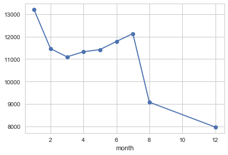


** Now see if you can use seaborn's lmplot() to create a linear fit on the number of calls per month. Keep in mind you may need to reset the index to a column. **


```python
by_month = by_month.reset_index()
sns.lmplot(data=by_month, x='month', y='e')
```


    <seaborn.axisgrid.FacetGrid at 0xed81218f28>


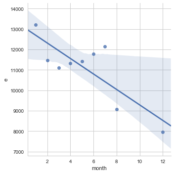


**Create a new column called 'Date' that contains the date from the timeStamp column. You'll need to use apply along with the .date() method. ** 


```python
call_data['date'] = call_data['timeStamp'].apply(lambda data:data.date())
```

** Now groupby this Date column with the count() aggregate and create a plot of counts of 911 calls.**


```python
call_data_by_date = call_data.groupby('date').count()
call_data_by_date['e'].plot.line(figsize=(7,4))
```


    <matplotlib.axes._subplots.AxesSubplot at 0xed81218f98>


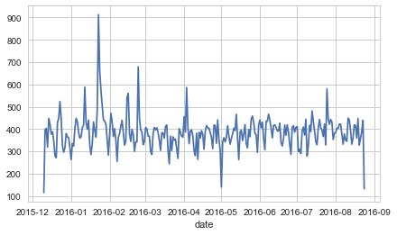


** Now recreate this plot but create 3 separate plots with each plot representing a Reason for the 911 call**


```python
call_data_by_date_Traffic = call_data[call_data['reason'] == 'Traffic'].groupby('date').count()
call_data_by_date_Traffic['e'].plot.line(figsize=(7,4))
```


    <matplotlib.axes._subplots.AxesSubplot at 0xed8123c8d0>


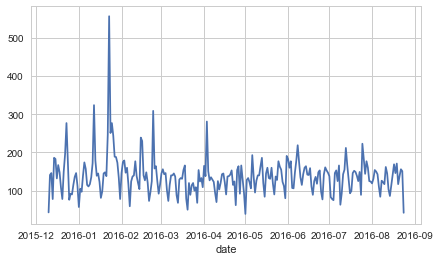


```python
call_data_by_date_Fire = call_data[call_data['reason'] == 'Fire'].groupby('date').count()
call_data_by_date_Fire['e'].plot.line(figsize=(7,4))
```


    <matplotlib.axes._subplots.AxesSubplot at 0xed81324f98>


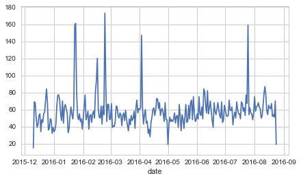


```python
call_data_by_date_EMS = call_data[call_data['reason'] == 'EMS'].groupby('date').count()
call_data_by_date_EMS['e'].plot.line(figsize=(7,4))
```


    <matplotlib.axes._subplots.AxesSubplot at 0xed813ac6d8>


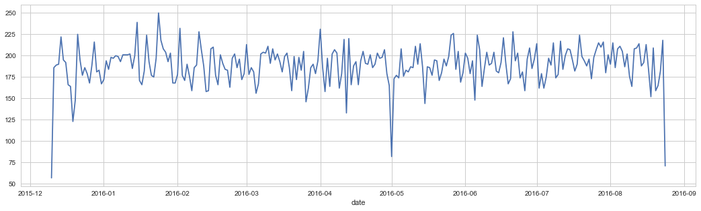


____
** Now let's move on to creating  heatmaps with seaborn and our data. We'll first need to restructure the dataframe so that the columns become the Hours and the Index becomes the Day of the Week. There are lots of ways to do this, but I would recommend trying to combine groupby with an [unstack](http://pandas.pydata.org/pandas-docs/stable/generated/pandas.DataFrame.unstack.html) method. Reference the solutions if you get stuck on this!**


```python
dayhour = call_data.groupby(['day of week', 'hour']).count()['e'].unstack()
```

** Now create a HeatMap using this new DataFrame. **


```python
plt.figure(figsize=(12,6))
sns.heatmap(dayhour, cmap='viridis')
```


    <matplotlib.axes._subplots.AxesSubplot at 0xed813ac208>


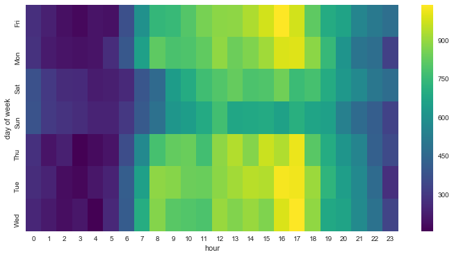


** Now create a clustermap using this DataFrame. **


```python
plt.figure(figsize=(12,6))
sns.clustermap(dayhour, cmap='viridis')
```


    <seaborn.matrix.ClusterGrid at 0xed8285ab70>


    <Figure size 864x432 with 0 Axes>


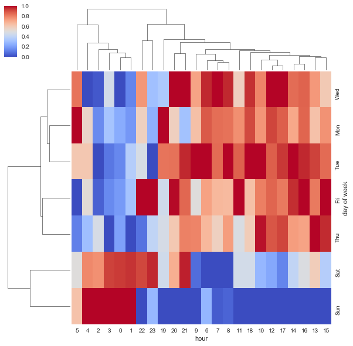


** Now repeat these same plots and operations, for a DataFrame that shows the Month as the column. **


```python
call_data.pivot_table(index = 'day of week', columns='month', values='e')
```


<div>
<table border="1" class="dataframe">
  <thead>
    <tr style="text-align: right;">
      <th>month</th>
      <th>1</th>
      <th>2</th>
      <th>3</th>
      <th>4</th>
      <th>5</th>
      <th>6</th>
      <th>7</th>
      <th>8</th>
      <th>12</th>
    </tr>
    <tr>
      <th>day of week</th>
      <th></th>
      <th></th>
      <th></th>
      <th></th>
      <th></th>
      <th></th>
      <th></th>
      <th></th>
      <th></th>
    </tr>
  </thead>
  <tbody>
    <tr>
      <th>Fri</th>
      <td>1</td>
      <td>1</td>
      <td>1</td>
      <td>1</td>
      <td>1</td>
      <td>1</td>
      <td>1</td>
      <td>1</td>
      <td>1</td>
    </tr>
    <tr>
      <th>Mon</th>
      <td>1</td>
      <td>1</td>
      <td>1</td>
      <td>1</td>
      <td>1</td>
      <td>1</td>
      <td>1</td>
      <td>1</td>
      <td>1</td>
    </tr>
    <tr>
      <th>Sat</th>
      <td>1</td>
      <td>1</td>
      <td>1</td>
      <td>1</td>
      <td>1</td>
      <td>1</td>
      <td>1</td>
      <td>1</td>
      <td>1</td>
    </tr>
    <tr>
      <th>Sun</th>
      <td>1</td>
      <td>1</td>
      <td>1</td>
      <td>1</td>
      <td>1</td>
      <td>1</td>
      <td>1</td>
      <td>1</td>
      <td>1</td>
    </tr>
    <tr>
      <th>Thu</th>
      <td>1</td>
      <td>1</td>
      <td>1</td>
      <td>1</td>
      <td>1</td>
      <td>1</td>
      <td>1</td>
      <td>1</td>
      <td>1</td>
    </tr>
    <tr>
      <th>Tue</th>
      <td>1</td>
      <td>1</td>
      <td>1</td>
      <td>1</td>
      <td>1</td>
      <td>1</td>
      <td>1</td>
      <td>1</td>
      <td>1</td>
    </tr>
    <tr>
      <th>Wed</th>
      <td>1</td>
      <td>1</td>
      <td>1</td>
      <td>1</td>
      <td>1</td>
      <td>1</td>
      <td>1</td>
      <td>1</td>
      <td>1</td>
    </tr>
  </tbody>
</table>
</div>


```python

```


    <matplotlib.axes._subplots.AxesSubplot at 0x1304fbd30>


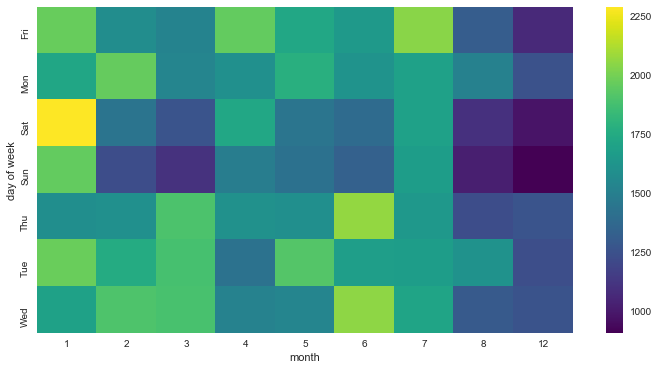


```python

```


    <seaborn.matrix.ClusterGrid at 0x12a1a61d0>


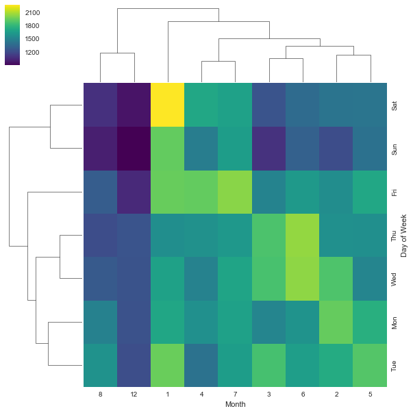

